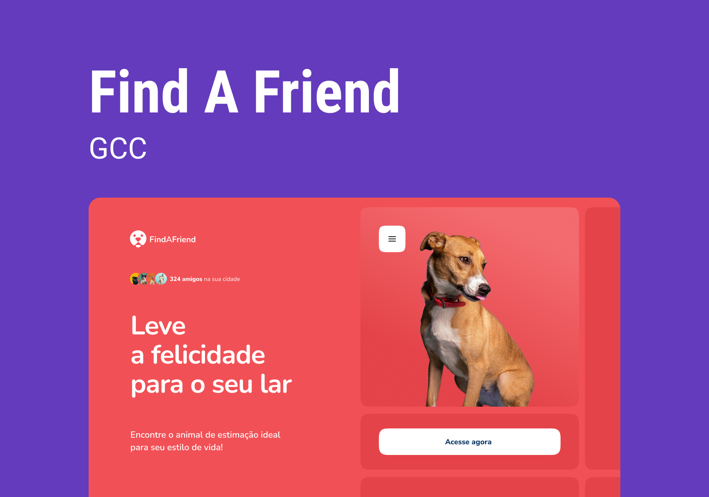

<h1 align="center"> FIND A FRIEND </h1>

Repositório do Explorer Green Chain Challenge (GCC) um desafio criado pela Rocketseat para os alunos do curso Explorer.  

  <a href="#technologies">Technologies</a>&nbsp;&nbsp;&nbsp;|&nbsp;&nbsp;&nbsp;
  <a href="#project">Project</a>&nbsp;&nbsp;&nbsp;|&nbsp;&nbsp;&nbsp;
  <a href="#layout">Layout</a>

 

  

## 🚀 Technologies

Esse projeto foi desenvolvido com as seguintes tecnologias:

- HTML e CSS
- JavaScript
- Git e Github
- Figma

## 💻 Project

Ao entrar na aplicação, a pessoa adotante pode filtrar os bichinhos de acordo com suas preferências e lifestyle.
Depois é só entrar em contato com a ONG para agendar uma visita e conhecer pessoalmente seu match perfeito!

- [Visite o projeto online](https://findafriend-raulrodmo.netlify.app/)

## 🔖 Layout

Você pode visualizar o layout do projeto através [DESSE LINK](<https://www.figma.com/file/mdjTYxImijoaWBrgilPnPc/GCC-1-FindAFriend-Community?is-community-duplicate=1&fuid=). É necessário ter conta no [Figma](https://figma.com) para acessá-lo.

---

Made with 💜 by raulrodmo

